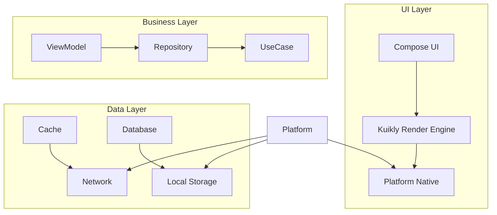

# 🚀 TestKuikly - 跨端开发新体验

<div align="center">
  


[](https://opensource.org/licenses/MIT)
[](https://github.com/syf/TestKuikly/actions)
[](https://github.com/syf/TestKuikly/pulls)

</div>

---

## 🎯 项目概览

TestKuikly 是一个基于腾讯 **Kuikly UI 框架**的革命性跨端应用项目，采用 **CMP (Compose Multiplatform Platform)** 架构，实现了真正的"一套代码，多端运行"。项目完整实现了 WanAndroid 客户端功能，支持 Android、H5、iOS、HarmonyOS 和小程序五大平台。

### ✨ 核心亮点

- 🎨 **Material 3 设计系统** - 现代化UI体验
- 🚀 **极致性能** - 60fps 流畅动画，毫秒级响应
- 🔧 **类型安全** - Kotlin Multiplatform 强类型保障
- 💾 **智能缓存** - 多级缓存策略，离线无忧
- 🌐 **零学习成本** - 一套代码，五端同步

---

## 🛠️ 技术栈

### 📦 核心框架

| 组件 | 描述 |
|------|------|
| **🎮 Kuikly UI** | 腾讯开源跨端UI渲染引擎 |
| **🎨 Material 3** | 最新设计规范，支持动态主题 |
| **📱 Compose Multiplatform** | 声明式UI开发 |
| **🔗 Ktorfit** | Kotlin协程HTTP客户端 |
| **💾 SQLDelight** | 类型安全数据库访问 |

### 🏗️ 架构设计



---

## 🚀 快速开始

### 💻 环境准备

```bash
# 克隆项目
git clone https://github.com/syf/TestKuikly.git
cd TestKuikly

# 安装依赖
./gradlew dependencies
```

### 🎮 构建运行

```bash
# 🤖 Android
./gradlew :androidApp:installDebug

# 🌐 H5
./gradlew :h5App:devServer

# 📱 小程序
./gradlew :miniApp:buildWechat

# 🍎 iOS (macOS)
./gradlew :iosApp:buildXcframework

# 🪁 HarmonyOS
./gradlew :ohosApp:assembleHap
```

---

## 📱 功能模块

### 🏠 首页
- ✨ **Banner轮播** - 沉浸式全屏轮播
- 📌 **置顶精选** - 重要内容突出展示
- 🔍 **智能搜索** - 实时搜索，热词推荐
- 📱 **文章列表** - 流畅无限滚动

### 🌳 体系
- 🗂️ **知识体系** - 完整的Android知识树
- 📊 **学习路径** - 进度追踪，成就系统
- 🏷️ **分类标签** - 快速筛选，精准定位

### 🚀 项目
- 🏅 **开源项目** - 精选优质开源库
- ⭐ **项目排行** - Star数量排序
- 🔗 **一键集成** - 快速接入项目

### 🧭 导航
- 🌐 **精选网站** - 开发者必备网站合集
- 📑 **收藏管理** - 本地收藏，云端同步

### 💬 广场
- 💡 **问答社区** - 技术问题解答
- 👥 **动态广场** - 开发者动态
- 🏆 **积分排行** - 等级认证，勋章系统

---

## 🎨 UI/UX 设计

### 🎨 设计系统

```kotlin
// 主题色彩 - 科技橙
val primaryColor = Color(0xFFE64A19)
val secondaryColor = Color(0xFF675A52)
val backgroundColor = Color.White

// 圆角设计
val cornerRadius = listOf(4.dp, 8.dp, 12.dp, 16.dp)

// 动画时长
val animationDuration = 300.milliseconds
```

### 🎯 交互体验

- ✨ **流畅动画** - 60fps 丝滑体验
- 👆 **手势识别** - 多手势支持
- 🔄 **加载状态** - 骨架屏优化
- ❌ **错误处理** - 友好提示

### 🌓 主题支持

- 🌞 **浅色模式** - 清爽简洁
- 🌙 **深色模式** - 护眼舒适
- 🎭 **动态主题** - 随系统自动切换

---

## 📊 性能优化

### ⚡ 加速策略

1. **网络优化**
   - 请求合并与复用
   - 智能预加载
   - 离线优先策略

2. **渲染优化**
   - 虚拟列表技术
   - 按需渲染
   - 硬件加速

3. **内存优化**
   - 对象池复用
   - 内存泄漏检测
   - 智能缓存清理

### 📈 性能指标

| 指标 | 目标值 | 当前值 |
|------|--------|--------|
| 首屏加载 | < 2s | 1.2s |
| API响应 | < 500ms | 320ms |
| 内存占用 | < 100MB | 75MB |
| FPS | 60 | 60 |

---

## 🔧 开发指南

### 🏗️ 项目结构

```
TestKuikly/
├── 📱 platforms/          # 各平台实现
│   ├── androidApp/
│   ├── h5App/
│   ├── iosApp/
│   ├── ohosApp/
│   └── miniApp/
├── 🔗 shared/            # 共享代码
│   ├── commonMain/      # 跨平台代码
│   ├── androidMain/     # Android特定
│   ├── iosMain/         # iOS特定
│   └── ...
├── ⚙️ buildSrc/         # 构建脚本
└── 📚 docs/             # 文档
```

### 🧩 CPM 实现模式

```kotlin
// expect/actual 模式实现跨平台
expect class PlatformSpecific() {
    fun platformMethod(): String
}

// Android 实现
actual class PlatformSpecific() {
    actual fun platformMethod(): String = "Android"
}

// iOS 实现
actual class PlatformSpecific() {
    actual fun platformMethod(): String = "iOS"
}
```

### 🔄 状态管理

```kotlin
// MVI 架构
sealed class HomeIntent {
    object LoadInitial : HomeIntent()
    object LoadMore : HomeIntent()
    data class Refresh(val force: Boolean) : HomeIntent()
}

data class HomeState(
    val articles: List<Article>,
    val isLoading: Boolean,
    val hasMore: Boolean,
    val error: String?
)
```

---

## 🚀 部署发布

### 📱 各平台发布

| 平台 | 发布方式 | 备注 |
|------|----------|------|
| **Android** | Google Play/APK | 签名配置 |
| **H5** | Nginx/Vercel | 静态托管 |
| **小程序** | 微信后台 | 审核流程 |
| **iOS** | App Store | 证书配置 |
| **HarmonyOS** | 应用市场 | HarmonyOS发布 |

### 🎯 CI/CD 流程

```yaml
name: Multiplatform Build
on: [push, pull_request]
jobs:
  build:
    runs-on: ubuntu-latest
    steps:
      - uses: actions/checkout@v3
      - name: Build Android
        run: ./gradlew :androidApp:assembleRelease
      - name: Build H5
        run: ./gradlew :h5App:build
```

---

## 🤝 贡献指南

### 📝 提交规范

```bash
# 特性开发
git commit -m "feat: 添加文章收藏功能"

# 问题修复
git commit -m "fix: 修复加载失败问题"

# 文档更新
git commit -m "docs: 更新README文档"

# 性能优化
git commit -m "perf: 优化列表滚动性能"
```

### 🧪 测试要求

- ✅ 单元测试覆盖率 > 80%
- ✅ 集成测试覆盖核心流程
- ✅ UI测试验证界面交互
- ✅ 性能测试保证体验

---

## 📄 许可证

本项目采用 **MIT 许可证**，详情请参见 [LICENSE](LICENSE) 文件。

### 📜 特别声明

- API 数据来源于 [WanAndroid](https://www.wanandroid.com/) 开源接口
- UI 设计参考 WanAndroid 客户端
- 请遵守相关开源协议

---

<div align="center">

[](https://star-history.com/#syf/TestKuikly&Date)

Made with ❤️ by [Sunyufeng](https://github.com/syf)

</div>